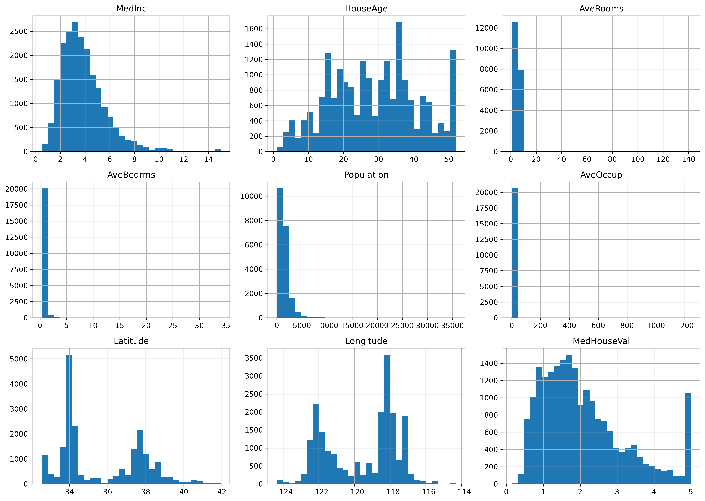
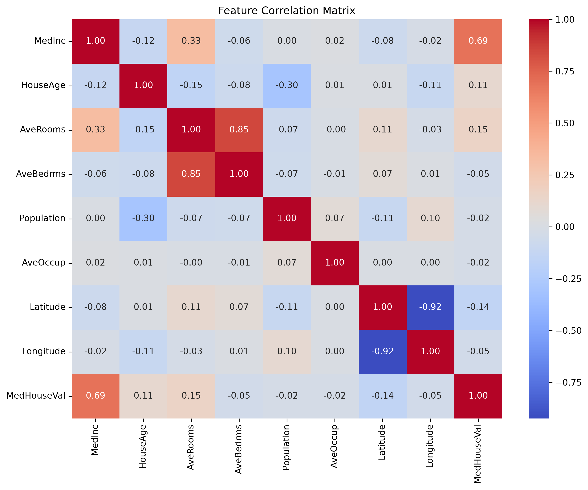
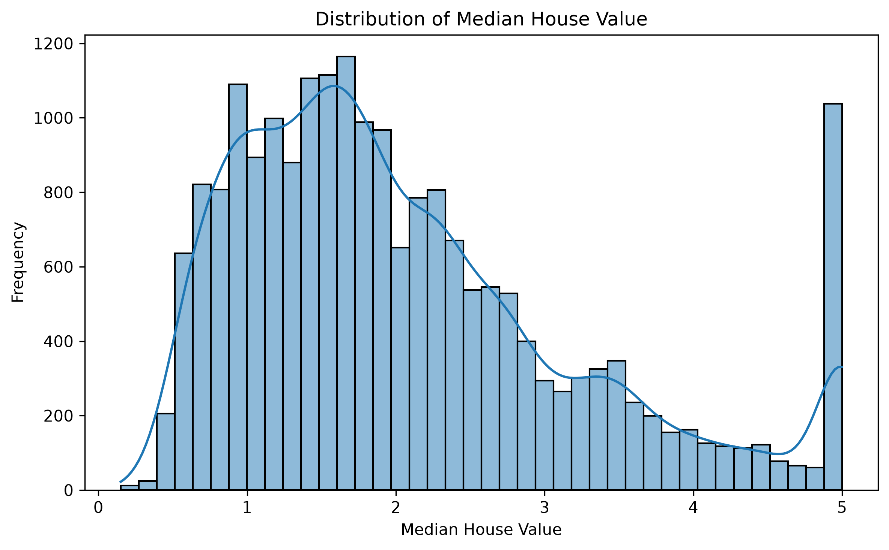
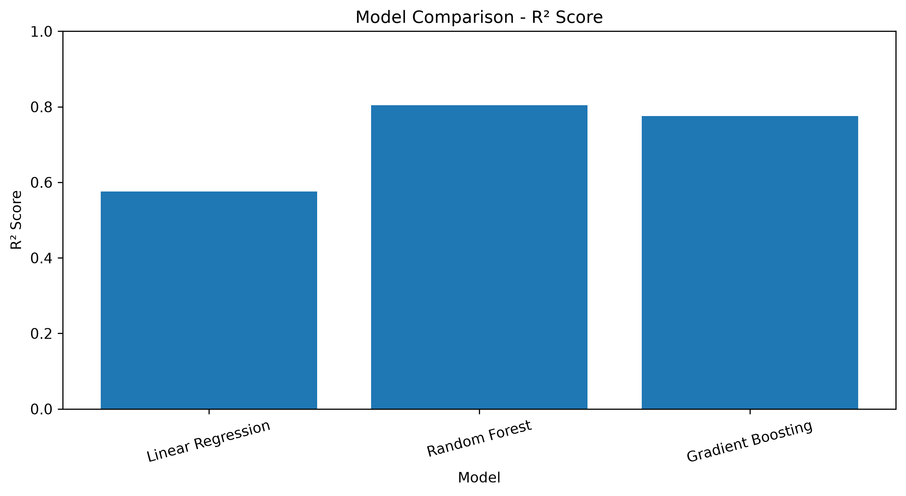
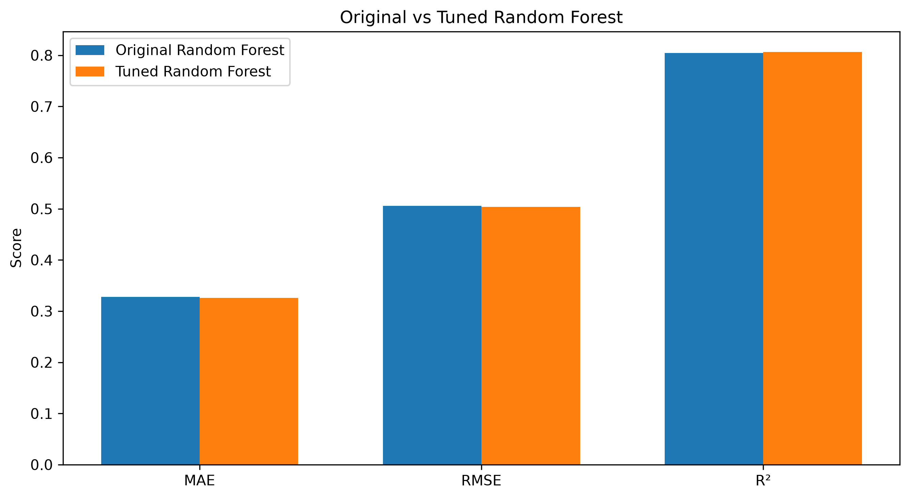
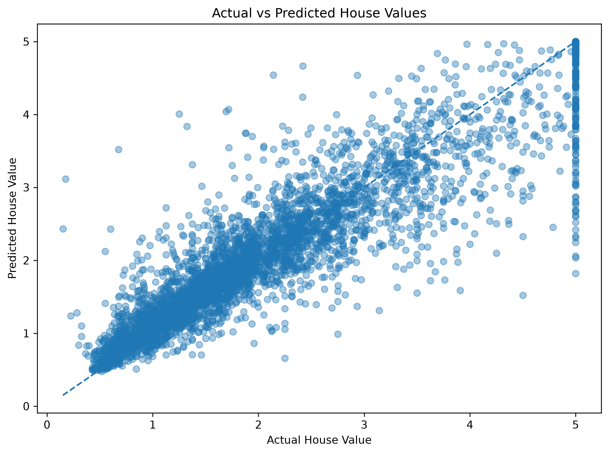

# 🏠 House Price Prediction Web App

An end-to-end machine learning web application that predicts median house values using a tuned Random Forest regression model and a Flask web interface.

The project combines **machine learning, model evaluation, Flask backend development, and HTML/CSS frontend design** into a complete working application.

---

## 📌 Project Overview

This project uses the **California Housing dataset** to predict median house values from demographic, housing, and geographic features.

The workflow covers the complete machine learning pipeline:

```text
California Housing Dataset
        ↓
Exploratory Data Analysis
        ↓
Data Preparation
        ↓
Model Training
        ↓
Model Comparison
        ↓
Hyperparameter Tuning
        ↓
Final Random Forest Model
        ↓
Model Serialization
        ↓
Flask Web Application
        ↓
User Input
        ↓
House Price Prediction
```

---

## 🎯 Objectives

* Explore and visualize the housing dataset
* Train multiple regression models
* Compare model performance using MAE, RMSE, and R²
* Perform hyperparameter tuning
* Save the final trained model
* Build a Flask backend for prediction
* Create a responsive HTML/CSS interface
* Validate user inputs
* Integrate the machine learning model into a working web application

---

## 🧠 Machine Learning

### Dataset

The project uses the **California Housing dataset** available through `scikit-learn`.

The dataset contains **20,640 observations** and 8 input features.

### Features

| Feature      | Description                 |
| ------------ | --------------------------- |
| `MedInc`     | Median income               |
| `HouseAge`   | Median house age            |
| `AveRooms`   | Average number of rooms     |
| `AveBedrms`  | Average number of bedrooms  |
| `Population` | Population of the area      |
| `AveOccup`   | Average household occupancy |
| `Latitude`   | Geographic latitude         |
| `Longitude`  | Geographic longitude        |

### Target

`MedHouseVal`

The target represents the median house value in units of **$100,000**.

For example:

```text
3.50 → approximately $350,000
```

---

## 🤖 Models

Three regression models were trained and compared:

* Linear Regression
* Random Forest Regressor
* Gradient Boosting Regressor

### Model Comparison

| Model             |    MAE |   RMSE |     R² |
| ----------------- | -----: | -----: | -----: |
| Linear Regression | 0.5332 | 0.7456 | 0.5758 |
| Random Forest     | 0.3277 | 0.5060 | 0.8046 |
| Gradient Boosting | 0.3716 | 0.5422 | 0.7756 |

Random Forest produced the strongest overall performance.

---

## ⚙️ Hyperparameter Tuning

GridSearchCV with 5-fold cross-validation was used to optimize the Random Forest model.

### Best Parameters

```text
n_estimators = 200
max_depth = None
min_samples_split = 2
min_samples_leaf = 2
```

### Final Performance

| Metric |  Score |
| ------ | -----: |
| MAE    | 0.3261 |
| RMSE   | 0.5040 |
| R²     | 0.8062 |

The tuned Random Forest model was selected as the final model and saved using `joblib`.

---

## 🌐 Web Application

The trained model is integrated into a Flask web application.

Users can enter:

* Median income
* House age
* Average rooms
* Average bedrooms
* Population
* Average occupancy
* Latitude
* Longitude

The application sends the input to the trained Random Forest model and returns the estimated median house value.

### Example

```text
Input:
Median Income = 5
House Age = 20
Average Rooms = 6
Average Bedrooms = 1
Population = 1000
Average Occupancy = 3
Latitude = 34
Longitude = -118

Prediction:
Approximately $230,926
```

---

## 🛡️ Input Validation

The Flask application includes server-side validation to prevent invalid inputs.

Examples include:

* Invalid numeric values
* Missing form fields
* Unrealistic geographic coordinates
* Invalid population values
* Out-of-range housing values

Invalid inputs return a user-friendly error message instead of generating a prediction.

---

## 🖥️ Technology Stack

### Machine Learning

* Python
* Pandas
* NumPy
* Scikit-learn
* Joblib

### Data Visualization

* Matplotlib
* Seaborn

### Web Development

* Flask
* HTML
* CSS

### Development Environment

* Jupyter Notebook
* VS Code
* Git
* GitHub

---

## 📁 Project Structure

```text
house-price-prediction-app/
│
├── data/
│   └── housing.csv
│
├── images/
│   ├── feature_distributions.png
│   ├── correlation_matrix.png
│   ├── target_distribution.png
│   ├── model_comparison_r2.png
│   ├── random_forest_tuning.png
│   └── actual_vs_predicted.png
│
├── model/
│   └── house_price_model.pkl
│
├── notebooks/
│   └── house_price_model.ipynb
│
├── static/
│   └── style.css
│
├── templates/
│   └── index.html
│
├── app.py
├── .gitignore
├── README.md
└── requirements.txt
```

---

## 📊 Visualizations

### Feature Distributions



### Correlation Matrix



### Target Distribution



### Model Comparison



### Random Forest Tuning



### Actual vs Predicted



---

## 🚀 How to Run

### 1. Clone the repository

```bash
git clone https://github.com/Rajesh-code11/house-price-prediction-app.git
```

```bash
cd house-price-prediction-app
```

### 2. Create a virtual environment

```bash
python -m venv .venv
```

### 3. Activate the virtual environment

Windows PowerShell:

```powershell
.\.venv\Scripts\Activate.ps1
```

If PowerShell blocks the activation script:

```powershell
Set-ExecutionPolicy -Scope Process -ExecutionPolicy Bypass
```

Then activate again:

```powershell
.\.venv\Scripts\Activate.ps1
```

### 4. Install dependencies

```bash
pip install -r requirements.txt
```

### 5. Run the Flask application

```bash
python app.py
```

### 6. Open the application

Visit:

```text
http://127.0.0.1:5000
```

---

## ⚠️ Limitations

This project is intended as an educational and portfolio demonstration.

The model:

* Uses historical California Housing data
* Does not represent current real-estate market prices
* Should not be used for financial or real-estate decisions
* Has limited generalization outside the original dataset

---

## 🔮 Future Improvements

Possible improvements include:

* Deploy the application online
* Add interactive visualizations
* Add automatic model retraining
* Add a REST API endpoint
* Improve input validation with dataset-based ranges
* Add Docker support
* Add automated testing
* Experiment with XGBoost or other advanced regression models

---

## 👨‍💻 Author

**Rajesh**

Computer Science Student | Python & Machine Learning | NLP & AI

GitHub:

https://github.com/Rajesh-code11

---

## ⭐ Project Highlights

This project demonstrates an end-to-end workflow from **raw data to a working machine learning web application**.

Key skills demonstrated:

`Python` · `Machine Learning` · `Regression` · `Random Forest` · `Scikit-learn` · `Model Evaluation` · `Hyperparameter Tuning` · `Flask` · `HTML` · `CSS` · `Git` · `GitHub`
